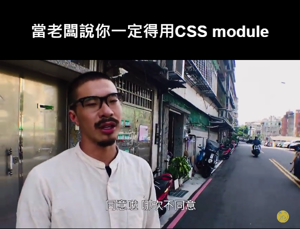

# CSS Framework 到底怎麼選？Tailwind CSS ? styled components ? CSS Module ? (1) ─ 談案例

對於我這種選擇障礙來說，看到這麼多選項只覺得頭昏眼花，不如就看看老闆怎麼說？



等等，身為一位前端工程師，現在不是你放棄思考的時候，而是你展現專業的時候才對吧？<br>
「啊我就怕被罵啊！」<br>
不要怕被罵，畢竟付你錢就是請你來被罵的(X

### 與其攤開表格來比較各項優缺，我更喜歡直接用實作場景來切入 🔎...

假設我們今天有個 Button component，先來個最傳統的版本 (以 React 為例)：<br>

```
// jsx
function MyButton() {
  return <div className="button">Button</div>
}
// how to use
<MyButton />
```

```
/* css */
.button {
  width: 120px;
  height: 30px;
  fontSize: 14px;
  fontWeight: 500;
  color: white;
  background-color: black;
}
```

接下來，我們根據 **Design Guideline** 將它設計成三個 props 的組件<br>
分別是: `variant` (決定種類 EX: primary, warning, error), `size` (決定大小), `status` (決定是否可點擊) <br>

### 就組件管理而言, 如何將組件的 props 跟 style 綁定一直是個重大課題 📌

##### 對於這點 CSS module 可以透過一些技巧來綁定對應的 class:

```
// jsx
export function MyButton({ variant, size, status }) {
  return (
    <div className={`button button-${variant} button-${size} button-${status}`}>
      Button
    </div>
  )
}
// how to use
<MyButton variant="primary" size="big" status="disable"/>
```

```
/* scss */
.button {
  width: 120px;
  height: 30px;
  font-size: 14px;
  font-weight: 500;
  color: white;
  background-color: black;
  &-primary: {
    font-weight: bold;
    background-color: green;
    border-radius: 10px;
  }
  &-big {
    width: 200px;
    height: 50px;
  }
  &-disable {
    pointer-events: none;
  }
}
```

覆蓋順序是相當直觀的後蓋前，也就是如果 `button-primary` 跟 `button-disable` 有重複的 style，會是後宣告的 `button-disable` 贏。

##### 而 styled components (emotion) 則是:

```
// jsx
import styled from '@emotion/styled'
import { css } from '@emotion/react'
const ButtonDefault = (props) => css`
  width: 120px;
  height: 30px;
  font-size: 14px;
  font-weight: 500;
  color: white;
  background-color: black;
  pointer-events: ${props.isDisable ? 'none' : 'auto'};
`
const PrimaryButton = styled.div`
  ${ButtonDefault};
  font-weight: bold;
  background-color: green;
  border-radius: 10px;
`
const BigButton = styled.div`
  ${ButtonDefault};
  width: 200px;
  height: 50px;
`
// how to use
<PrimaryButton isDisable={true}>Button</PrimaryButton>
<BigButton isDisable={true}>Button</BigButton>
```

> ##### _你可能會納悶，為什麼要把 CSS 的事情挪到 JS 裡面來做呢？你看他到頭來還是寫 css syntax 呀？_

### 其實所有的 css-in-js 解決方案本質上只有一個目的，那就是利用 JS 的特性來更好的管理、抽換 style

以上面的例子來說，假設我們今天需要 `button` 多一種 `disable` 的狀態，那兩種方案的順序會是：<br>

**CSS module： 新增 `.button-disable` 的 class -> 透過 `button-${props.status}` 的方式來綁定 classname -> 傳入 `status` props 即可連動 classname**<br>

**styled components： 在原本 `button` 的 class 內部新增一行三元判斷 -> 傳入 `isDisable` props 即可連動該 `pointer-events` 屬性**

---

你會發現 css-in-js 不再需要額外透過一些技巧綁定 classname 了，因為他的 css 定義在 js 內，所以可以**直接拿 props 來判斷屬性值就好。**

以開發體驗來說，**styled components** 少了一些思考如何 **binding classname** 的心智煩惱，也多了更多的 js 特性可以作為武器使用 (ex: 三元、Object)，看起來簡直完美！

但眼尖的讀者應該有發現，這邊的寫法跟 CSS module 有些許不同。

```
// how to use
<PrimaryButton isDisable={true}>Button</PrimaryButton>
<BigButton isDisable={true}>Button</BigButton>
```

**現在我們的 `button` 不能同時是 `primary` 也是 `big` 了。**

這是因為我把 `PrimaryButton` 與 `BigButton` 分開定義的緣故。<br>
如果你想要做出 CSS module 那種 `class="button button-primary button-big"` 的效果，這種寫法有可能會需要多個三元表達式，因為 `size="big"` 會同時影響 `width`, `height` 等多個屬性。<br>

例如下面這樣:

```
const ButtonDefault = (props) => css`
  width: ${props.isBig ? '200px' : '120px'};
  height: ${props.isBig ? '50px' : '30px'};
  fontSize: ${props.isBig ? '16px' : '14px'};
  fontWeight: 500;
  color: white;
  background-color: black;
  pointer-events: ${props.isDisable ? 'none' : 'auto'};
`
```

乍看之下蠻簡潔的沒什麼問題，但你可以明顯感覺到這種寫法的脆弱性，那就是：<br>
**當兩個以上的 props 都影響同一個 style property 的時候，就會變得很醜。**<br>
當然，如果你可以確保每個 props 對應的屬性彼此之間沒有交集，這種寫法就已經足夠好，
但**在實務上設計師的 design guideline 往往不見得會符合工程化的需求就是了 🙈。**

既然如此，那我們不要全部寫在同個 class 裡面，把他分開怎麼樣？就像 CSS module 分開定義 class 那樣！<br>
於是我們來試試看用 Emotion 官方提供的另一種 css prop 語法實作:

```
/** @jsxImportSource @emotion/react */
import { css } from '@emotion/react'
const buttonDefaultCSS = {
  width: '120px',
  height: '30px',
  fontSize: '14px',
  fontWeight: 500,
  color: 'white',
  backgroundColor: 'black',
}
const variantButtonCSS = {
  primary: {
    ...buttonDefaultCSS,
    fontWeight: 'bold',
    backgroundColor: 'green',
    borderRadius: '10px'
  }
}
const sizeButtonCSS = {
  big: {
    width: '200px',
    height: '50px'
  }
}
const disableCSS = {
  pointerEvents: 'none',
  backgroundColor: 'gray'
}
function MyButton({ variant, size, isDisable }) {
  const buttonStyles = css({
    ...variantButtonCSS[variant],
    ...sizeButtonCSS[size],
    ...(isDisable ? disableCSS : null)
  })
  return <div css={buttonStyles}>Button</div>
}
export default MyButton
// how to use
<MyButton variant="primary" size="big" isDisable={false} />
```

登愣 👏！Mission complete！我們利用 **JS Object property 後蓋前的特性**完美解決了 style 屬性重複的問題，這方法也能很優雅地**應對增加 props 的情況** (比如多一種 variant 之類的)，不知道有沒有讓讀者稍微感受到 css-in-js 的魅力了呢？<br>
基本上有了 javascript 作為武器來管理 style，你不太會需要擔心 props 要如何跟 style 綁定，因為總會有一些 JS 的奇技淫巧可以解決 (例如上面同時使用 spread + 三元來組合 css object 就是一種方式)。

以上，對於 **CSS module** 以及 **styled components** 的介紹就先點到為止，相信讀者已經有點感覺了，我知道忽略了很多面相，這是因為暫時不想讓討論太發散，還請各位保持耐心。

下一篇同樣會以這個例子來著重講講 **Atomic css**。
