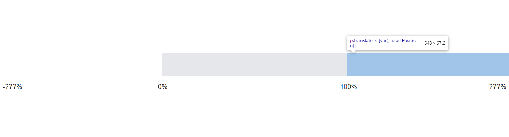
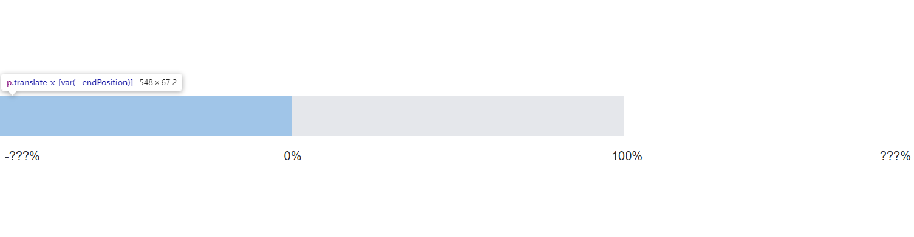

# 製作跑馬燈一點都不難，你只需要知道這些小訣竅

### 專案需要一個公告跑馬燈的新功能，你會想怎麼實作？

1. 首先新增一個 component:

```js
// src/components/Marquee.js
function Marquee() {
  return (
    <div className="relative top-[10rem] left-[30rem] right-[30rem] w-[(100vw-60rem)] h-[4.2rem] text-primary text-center italic [text-shadow:2px_2px_0px_#ffffff,_0_0_4px_#0f6513] whitespace-nowrap [line-height:4.2rem] text-4xl overflow-hidden translate-x-0 border-gray-800 bg-gray-200">
      <p className="w-full animate-runMarquee">這是一個跑馬燈</p>
    </div>
  );
}
export default Marquee;
```

> 值得注意的是，因為左右還要預留空間給其他元件各 `30rem`，所以寬度用 `w-[(100vw-60rem)]` 來計算。

2. 把 `animate-runMarquee` 動畫新增在 tailwind 設定檔中:

```js
// tailwind.config.js
module.exports = {
  content: ["./src/**/*.{js,jsx,ts,tsx}"],
  theme: {
    extend: {
      keyframes: {
        marquee: {
          "0%": {
            transform: "translateX(100%)",
          },
          "100%": {
            transform: "translateX(-100%)",
          },
        },
      },
      animation: {
        runMarquee: "marquee 7s linear infinite",
      },
    },
  },
};
```

> 動畫原理分為內外部兩個 DOM, 內部透過 `translateX()` 來移動, 外部加上 `overflow:hidden;`即可出現跑馬燈效果 (時間 7 秒暫時寫死)。

結果就會像這樣:


### 大功告成？等等，如果這麼簡單那我寫這篇要幹嘛？

但是，這個版本的跑馬燈時間是寫死的，所以不管文字有多長他輪詢的時間都是 7 秒，假如我們把文字長度改一下...

```html
<p className="w-full animate-runMarquee">
  跑馬燈1跑馬燈2跑馬燈3跑馬燈4跑馬燈5跑馬燈6跑馬燈7跑馬燈8跑馬燈9跑馬燈10
</p>
```


可以看到連整體文字都還沒完全顯示完，尚未看到 **_跑馬燈 8 跑馬燈 9 跑馬燈 10_** 就中斷重來了，總不可能每次都應對文字長度去手動調整動畫時間吧？(更何況這文字本身是後端來的)

### 顯然我們需要一些動態的計算！

> 讓我們來拆解一下問題, 思考一下跑馬燈的原理為何:

首先，動畫的開始位置永遠都是 100%，如圖所示:


至於結束位置嘛！根據字體的長度不同會影響最左側的結束位置到底有多遠 (-???%):


1. 前面的例子永遠將結束位置寫死為 100%，因而導致跑馬燈沒有全部顯示完畢就被切掉了。
2. 然後時間寫死的話，會導致跑馬燈的速率不一致 (距離/時間=速率, 而距離有可能隨著內容變長)。

綜上所述，目前的問題是，**需要根據文字長度動態計算跑馬燈的結束位置跟時間**。

### 結果


