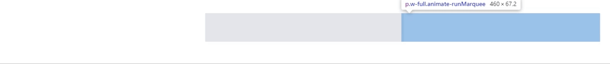

# 製作跑馬燈一點都不難，你只需要知道這些小訣竅


### 專案需要一個公告跑馬燈的新功能，你會想怎麼實作？

1. 首先新增一個 component:

```js
// src/components/Marquee.js
function Marquee() {
  return (
    <div className="relative top-[10rem] left-[30rem] right-[30rem] w-[(100vw-60rem)] h-[4.2rem] text-primary text-center italic [text-shadow:2px_2px_0px_#ffffff,_0_0_4px_#0f6513] whitespace-nowrap [line-height:4.2rem] text-4xl overflow-hidden translate-x-0 border-gray-800 bg-gray-200">
      <p className="w-full animate-runMarquee">這是一個跑馬燈</p>
    </div>
  );
}
export default Marquee;
```

> 值得注意的是，因為左右還要預留空間給其他元件各 `30rem`，所以寬度用 `w-[(100vw-60rem)]` 來計算。

2. 把 `animate-runMarquee` 動畫新增在 tailwind 設定檔中:

```js
// tailwind.config.js
module.exports = {
  content: ["./src/**/*.{js,jsx,ts,tsx}"],
  theme: {
    extend: {
      keyframes: {
        marquee: {
          "0%": {
            transform: "translateX(100%)",
          },
          "100%": {
            transform: "translateX(-100%)",
          },
        },
      },
      animation: {
        runMarquee: "marquee 7s linear infinite",
      },
    },
  },
};
```

> 動畫原理分為內外部兩個 DOM, 內部透過 `translateX()` 來移動, 外部加上 `overflow:hidden;`即可出現跑馬燈效果 (時間 7 秒暫時寫死)。

結果就會像這樣:


### 大功告成？等等，如果這麼簡單那我寫這篇要幹嘛？

但是，這個版本的跑馬燈時間是寫死的，所以不管文字有多長他輪詢的時間都是 7 秒，假如我們把文字長度改一下...

```html
<p className="w-full animate-runMarquee">
  跑馬燈1跑馬燈2跑馬燈3跑馬燈4跑馬燈5跑馬燈6跑馬燈7跑馬燈8跑馬燈9跑馬燈10
</p>
```


可以看到文字都還沒顯示完就中斷重來了，根本看不到 **_跑馬燈 8 跑馬燈 9 跑馬燈 10_** ，我們總不可能每次都去手動調整動畫時間吧？(更何況這文字本身是後端來的)

### 顯然我們需要一些動態的計算！

> 首先，讓我們來拆解一下問題，思考一下跑馬燈的原理為何:

因為要從 container 的最右邊開始移動，所以動畫的起始位置永遠都是 100%，如圖所示:


至於結束位置，根據字體的長度不同會影響最左邊的結束位置到底有多遠，**總之就是子節點的一倍寬度**。<br>
有人可能會好奇為何不是 -100%，原因是對於向左滑動的子節點來說，-100% 只代表父節點的寬度而不是他自己的寬度。


因此，我們可以歸納出兩個問題：

1. 前面的例子永遠將結束位置寫死為 -100%，因而導致跑馬燈沒有全部顯示完畢就被切掉了。
2. 時間寫死的話，會導致跑馬燈的速率不一致 (距離/時間=速率, 而距離有可能隨著內容變長)。

綜上所述，目前我們需要做的是：**根據文字長度動態計算跑馬燈的結束位置跟時間**。

### Talk is cheap. Show me the code.

```js
// Marquee.js
const RUN_ONCE_TIME = 4;
const [marqueeText, setMarqueeText] = useState("跑馬燈1跑馬燈2跑馬燈3跑馬燈4");
const [marqueeLengthRatio, setMarqueeLengthRatio] = useState(1);
const [marqueeTime, setMarqueeTime] = useState(0);

function checkMarquee(el) {
  const clientWidth = el.clientWidth;
  const scrollWidth = el.scrollWidth;
  const ratio = Math.round(scrollWidth / clientWidth);
  setMarqueeLengthRatio(ratio);
  setMarqueeTime(Math.round((ratio + 1) * RUN_ONCE_TIME));
}

useEffect(() => {
  checkMarquee(marqueeEl.current);
}, [marqueeText]);
```

先來講解最核心的部分，我們可以透過計算父節點 `clientWidth` 與 `scrollWidth` 的比例來決定結束位置跟動畫運行時間，假設 `scrollWidth` 是 `clientWidth` 的 1.5 倍，那結束位置就會是 `-150%`，時間就會是 `(1.5 + 1) * RUN_ONCE_TIME` 秒 (總距離是從 100% 到 -150%，所以是 250%，也就是 2.5 倍的 container 寬度)。

`RUN_ONCE_TIME` 這個常數比較特別，代表的是跑馬燈跑完一次父節點寬度的時間，你可以用手機的碼表簡單計時一下，抓出你要的速率大概跑一次 100% 會是幾秒鐘，然後再將其帶入上面的算式中。

接著你需要把剛剛的變數帶入 template:

```html
<div
  ref={marqueeEl}
  className="relative top-[10rem] left-[30rem] right-[30rem] w-[calc(100vw-60rem)] h-[4.2rem]
    text-primary text-center italic
    [text-shadow:2px_2px_0px_#ffffff,_0_0_4px_#0f6513] whitespace-nowrap
    [line-height:4.2rem] text-4xl overflow-hidden translate-x-0 border-gray-800
    bg-gray-200"
>
  {/* 加入 css variables */}
  <p
    style={{
      "--startPosition": "100%",
      "--endPosition": `-${marqueeLengthRatio * 100}%`,
      "--marqueeTime": `${marqueeTime}s`,
    }}
    className="animate-runMarquee"
  >
    {marqueeText}
  </p>
</div>
```

最後再引入到 tailwind 的設定中:

```js
// tailwind.config.js
module.exports = {
  content: ["./src/**/*.{js,jsx,ts,tsx}"],
  theme: {
    extend: {
      keyframes: {
        marquee: {
          "0%": {
            transform: "translateX(var(--startPosition))",
          },
          "100%": {
            transform: "translateX(var(--endPosition))",
          },
        },
      },
      animation: {
        runMarquee: "marquee var(--marqueeTime) linear infinite",
      },
    },
  },
};
```

### 結果

短文字:

長文字:


這下我們就成功做出了可以動態因應文字長度並固定速率的跑馬燈了，真是可喜可賀可口可樂！
