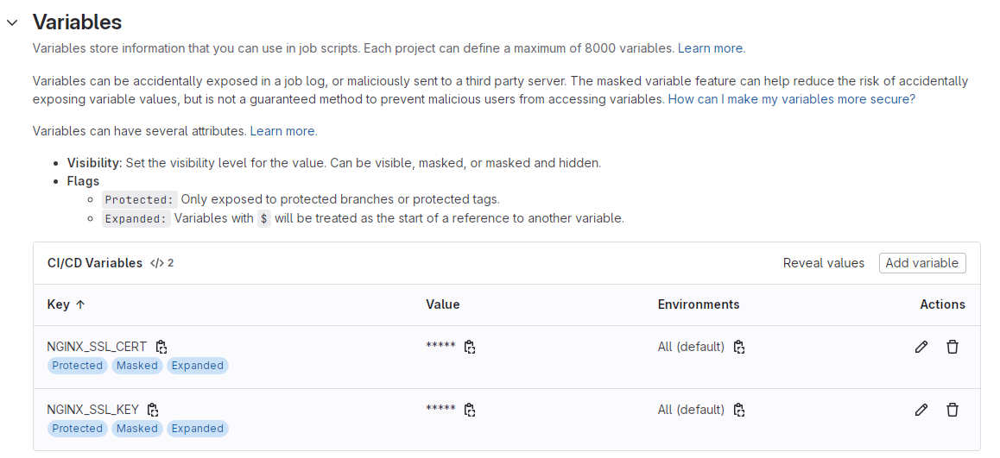

# 解放工程師的雙手，你需要好的 CI/CD ─ 搞定 gitlab-ci + 環境變數

上一篇搞定 gitlab-runner 的各種設定以後，我們馬上來建立一個簡單的 gitlab-ci 測試看看吧~<br>
喔對了`.gitlab-ci.yml`，檔名前面記得加`.`，不要跟我一樣耍笨 😓。

```
# .gitlab-ci.yml
stages:
  - deploy
deploy-job:
  stage: deploy
  script:
    - echo "Hello, $GITLAB_USER_LOGIN!"
    - pwd
    - whoami
    - echo "This job deploys from the $CI_COMMIT_BRANCH branch."
  only:
    - master
  tags:
    - test-runner
```

- **stages**: 定義這個 pipeline 有幾個不同階段，這個例子只有一個階段 `deploy` (意味著你在 Gitlab/CI/CD/Pipelines 就只會看到一個圈圈)。
- **deploy-job**: 定義了一個 job 名為 `deploy-job`，內部可指定它對應到哪個 stage。
- **script**: 逐行執行的指令。
- **$GITLAB_USER_LOGIN, $CI_COMMIT_BRANCH**: 此為 **Predefined Variables**，種類可參考[官方文件](https://docs.gitlab.com/ee/ci/variables/predefined_variables.html#predefined-variables)。
- **pwd**: 個人覺得顯示當前路徑 Debug 還蠻方便的，如果 pipeline 有什麼異常，可以直接進到機器的該目錄底下檢查，通常是`/home/gitlab-runner/builds/xxxxxxxx/0/your-project`。
- **only**: 限制這個 job 在某些條件下進行，**注意條件是 OR**，例如：<br>

```
only:
  - master
  - tags
```

**這個 job 只會在 master 分支或是下 tag 的時候觸發，如果需要 AND 請轉用 `rules:`。**

- **tags**: 此 tag 非彼 tag，這是**指定要讓哪個 runner 跑的 tag**，還記得嗎？我們上一篇文章在建立 runner 的時候有輸入 tag，這時候就派上用場了。**注意跟 `only:` 不同，這邊的邏輯是 AND**。例如：<br>

```
tags:
  - test-runner
  - production-runner
```

**代表這個 job 只能在同時是 `test-runner` 又是 `production-runner` 的 runner 上面跑** (每個 runner 可以設定多個 tag)，如果一個 job 找不到符合條件的 runner，你會在 pipeline 看到它**永遠是 pending 的狀態**。

> ### 把你的 commit push 到 master 吧！不久後你就可以看到 pipeline 的成功訊息了。

成功以後讓我們根據需求開始擴充這個 CI 吧~

### 搭配環境變數

如果是 React 專案的話，想必專案內可能會有多個 .env 檔案，我們假設專案內有`.env.development`, `.env.uat`, `.env.production`，分別對應到三種不同的執行環境。

> 不知道怎麼擴充使用 env 的，可以參考我之前寫的[這篇文章](https://yuanwu0000.github.io/zachary-gitbook/articles/react/env.html)。

這時候，我們要做的就是讓 CI 可以依據不同的 branch，執行不同的 build 指令，例如在 uat 環境是 `npm run build:uat`，在 production 環境則是 `npm run build`。

一般來說如果你使用 **Docker executor**，可以這樣做：

```
# .gitlab-ci.yml
stages:
  - build
build-for-uat:
  stage: build
  image: node:20
  script:
    - npm run build:uat
  only:
    - uat
  tags:
    - uat-runner
build-for-production:
  stage: build
  image: node:20
  script:
    - npm run build
  only:
    - master
  tags:
    - production-runner
```

**需要注意的是要記得開兩台 runner**，一台對應到 uat 環境，而另一台對應到 production 環境。

不過由於我在之前就已經把`Dockerfile`, `docker-compose.yaml`, `nginx.conf`都寫好了 (詳情可看[這篇文章](https://yuanwu0000.github.io/zachary-gitbook/articles/devops/deploy-your-project.html))，所以只需要 gitlab-ci 模擬手動部署的指令，因此我選擇使用 **Shell executor**，目標是要根據不同的 branch 來執行不同的`docker compose up`指令：

```
# .gitlab-ci.yml
stages:
  - deploy
deploy-to-uat:
  stage: deploy
  script:
    - sudo docker compose --env-file .env.uat up --build -d
  only:
    - uat
  tags:
    - uat-runner
deploy-to-production:
  stage: deploy
  script:
    - sudo docker compose --env-file .env.production up --build -d
  only:
    - master
  tags:
    - production-runner
```

可以發現我們透過分支的不同來決定要使用哪個環境變數檔：

```
# .env.uat
RAECT_APP_CLIENT_ID=xxx
...
DEPLOY_ENV=uat # 變數一
PROXY_URL=http://x.x.x.x:port # 變數二
```

```
# .env.production
RAECT_APP_CLIENT_ID=xxx
...
DEPLOY_ENV=production # 變數一
PROXY_URL=http://y.y.y.y:port # 變數二
```

這邊雖然與前端共用同一份環境變數，但別擔心，只要沒加上 REACT_APP 前綴就不會被 webpack 打包。<br>
我這次用到了兩個環境變數：<br>

- DEPLOY_ENV: 讓 Dockerfile 判斷當下執行環境，然後根據環境來下不同的`npm run build`指令。
- PROXY_URL: 不同機器上需要的代理伺服器 ip 也不同。

環境變數匯入以後，接著就是如何在 docker 內使用了~<br>
首先你會需要在`docker-compose`內部加入 build-time variables **(該變數只能在 build image 的階段使用，如果要在容器運行時使用請改用`environment`)**：

```
# docker-compose.yaml
services:
  web:
    build:
      context: .
      args:
        DEPLOY_ENV: ${DEPLOY_ENV} # 變數一
        PROXY_URL: ${PROXY_URL} # 變數二
```

然後在 Dockerfile 當中引入該變數：

```
# Dockerfile
FROM node:20 as build
ARG DEPLOY_ENV
ARG PROXY_URL
...
RUN npm config set proxy $PROXY_URL
RUN npm config set https-proxy $PROXY_URL
...
RUN if [ "$DEPLOY_ENV" = "uat" ]; then \
      npm run build:uat; \
    else \
      npm run build; \
    fi
```

> **注意 `if [ "$DEPLOY_ENV" = "uat" ]` 中括號內部一定要有左右空格，否則會語法錯誤，當初因為這個 Debug 了很久 😥。**

到這裡你已經根據不同環境執行了對應的 `npm run build` 指令，也成功處理了每台機器不同 proxy 的狀況，趕快來測試看看吧！

### 加入 SSL 憑證

現在來為你的網站加上 SSL 吧~關於如何設定 nginx.conf 可以看[這裡](https://yuanwu0000.github.io/zachary-gitbook/articles/devops/add-ssl.html)。

```
# .gitlab-ci.yml
stages:
  - deploy
cache:
  path:
    - ssl/
deploy-to-uat:
  stage: deploy
  before_script:
    - echo "I'm going to bind ssl certificate for your website..."
    - mkdir -p ssl/
    - echo "$NGINX_SSL_CERT" > ssl/nginx-ssl.crt
    - echo "$NGINX_SSL_KEY" > ssl/nginx-ssl.key
  script:
    - sudo docker compose --env-file .env.uat up --build -d
  only:
    - uat
  tags:
    - uat-runner
deploy-to-production:
  stage: deploy
  before_script:
    - echo "I'm going to bind ssl certificate for your website..."
    - mkdir -p ssl/
    - echo "$NGINX_SSL_CERT" > ssl/nginx-ssl.crt
    - echo "$NGINX_SSL_KEY" > ssl/nginx-ssl.key
  script:
    - sudo docker compose --env-file .env.production up --build -d
  only:
    - master
  tags:
    - production-runner
```

我們在 job 中新加入了 `before_script` 階段來預先建立 SSL 憑證的檔案，當中使用到的兩個環境變數：**$NGINX_SSL_CERT**、**$NGINX_SSL_KEY** 請先到 `Settings/CI/CD/Variables` 進行設定：<br>
(另外 gitlab-ci 也有 cache 的功能可以讓檔案在不同 job 或 pipeline 當中共用，像這裡就把 ssl/內容快取住了。)<br>



還記得嗎？我們之前在`docker-compose.yaml`檔案中有加上：<br>

```
volumes:
  - ./ssl:/etc/nginx/ssl
```

所以我們在 CI 加上這個步驟以後，**container 內部的 nginx 就可以吃到外部掛載的 ssl 檔案了！**

### 錨點 (Anchor)

覺得 CI 程式重複的部分有點多，想要抽離出來嗎？這邊剛好有一個被稱作錨點的 syntax 可以完成！當然，這完全是 optional 的，但如果你跟我一樣是個有潔癖的工程師，那就繼續看下去吧！

```
# .gitlab-ci.yml
stages:
  - deploy
cache:
  path:
    - ssl/
.deploy-job: &deploy-job
  stage: deploy
  before_script:
    - echo "I'm going to bind ssl certificate for your website..."
    - mkdir -p ssl/
    - echo "$NGINX_SSL_CERT" > ssl/nginx-ssl.crt
    - echo "$NGINX_SSL_KEY" > ssl/nginx-ssl.key
deploy-to-uat:
  <<: *deploy-job
  script:
    - sudo docker compose --env-file .env.uat up --build -d
  only:
    - uat
  tags:
    - uat-runner
deploy-to-production:
  <<: *deploy-job
  script:
    - sudo docker compose --env-file .env.production up --build -d
  only:
    - master
  tags:
    - production-runner
```

嗯！看起來舒服多了。

### 結語

實作到這邊，理論上你已經完成了專案初步的 CI/CD，它可以自動根據不同 branch 的 commit 來幫你把專案部署到不同機器上。<br>

當然如果你想改為下 tag 的時候部署，可以這麼做：<br>

```
only:
  - tags
```

或是你也可以簡單校驗一下 tag 格式：<br>

```
only:
  - /^v\d+\.\d+\.\d+$/
```

總之，這份 CI 還有很多地方可以讓你擴充，這部分就留給讀者自己挖掘了 (例如串接自動化測試)。<br>

還記得我第一次拼拼湊湊 CI/CD 的過程，自己看 pipeline log，自己進 container 偵錯，一行一行的撰寫 yml，最後當我在 Gitlab 看到那個打勾的綠色圈圈，粗俗一點講，就像是三天便秘終於暢通的那種感覺，如果可以，我也想讓你經歷那種專屬於工程師的美好時刻 (味道除外 😝)。
