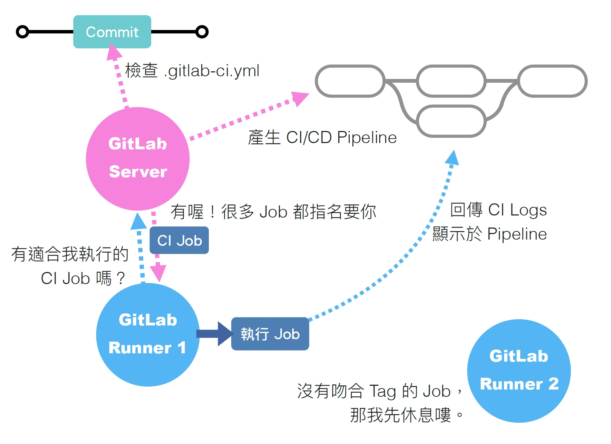
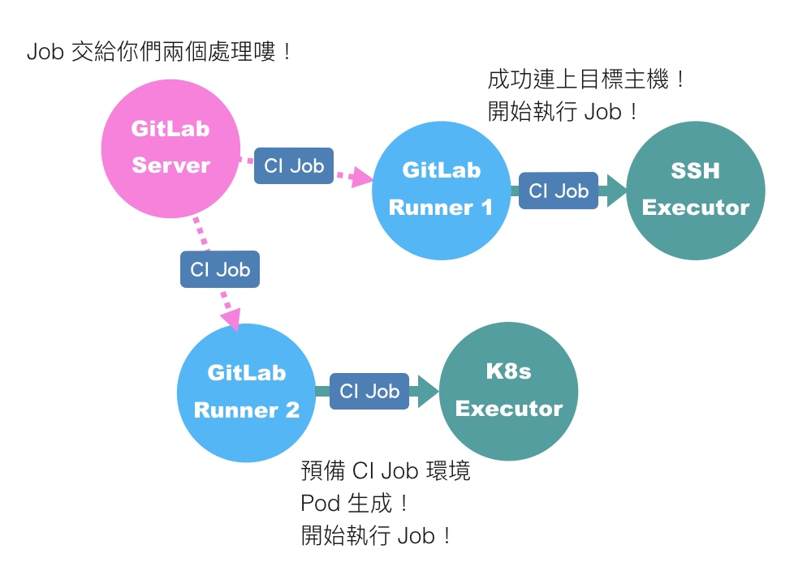

# 解放工程師的雙手，你需要好的 CI/CD ─ 搞定 gitlab-runner + executor

身為一位忙碌的工程師，右手握滑鼠，左手~~衛生紙~~，左手按鍵盤，根本不想額外花心力在手動部署上，這時候你需要的就是一套完整的 CI/CD。

CI/CD 的概念應該不用多做解釋，但在開始這一切之前，有人還不了解 gitlab CI 運作機制的嗎？我先在這邊附上艦長大大製的圖，非常淺顯易懂：<br>



簡單說，當你跟 Gitlab 做出互動，例如: 下 tag 或是 push commit，Gitlab 會自動觸發你專案中的 `gitlab-ci.yml`。<br>
接著 Gitlab 會需要找一台 server 來執行`gitlab-ci.yml`裡面的指令(Jobs)，這個執行的 server 就叫做 **gitlab-runner**。<br>
最後 Gitlab 會將 gitlab-runner 的執行過程跟執行結果顯示於 Pipeline 給你看。<br>

講完了理論，就讓我們開始動手實作吧~

### 1. Install gitlab-runner

首先，先進入你的部署機器內的 terminal，這一步驟主要是將 runner 安裝在機器上，這樣之後跑 CI 就會在這台機器上跑。

```
# Linux x86-64
sudo curl -L --output /usr/local/bin/gitlab-runner "https://s3.dualstack.us-east-1.amazonaws.com/gitlab-runner-downloads/latest/binaries/gitlab-runner-linux-amd64"
```

如果你在內網需要透過 proxy 才能導向外部網站:<br>

```
# Linux x86-64
sudo curl -L --output /usr/local/bin/gitlab-runner --proxy "http://your.proxy.ip:port" "https://s3.dualstack.us-east-1.amazonaws.com/gitlab-runner-downloads/latest/binaries/gitlab-runner-linux-amd64"
```

接著你需要給這個下載的 binary file 可執行的權限:<br>

```
sudo chmod +x /usr/local/bin/gitlab-runner
```

再來你需要新增一個名為 gitlab-runner 的使用者

```
sudo useradd --comment 'GitLab Runner' --create-home gitlab-runner --shell /bin/bash
```

這時候你也可以順便給他 sudo 免輸密碼的權限，這樣之後跑 CI 會方便一些:<br>
指令可參考[這裡](https://stackoverflow.com/questions/19383887/how-to-use-sudo-in-build-script-for-gitlab-ci)。

**最後就是安裝並啟動 gitlab-runner 了:**

```
sudo gitlab-runner install --user=gitlab-runner --working-directory=/home/gitlab-runner
sudo gitlab-runner start
```

### Register gitlab-runner

這個步驟的目的是要將 gitlab-runner 與你的專案**建立關聯**，並且指定 **executer**。<br>
好啦！又一個新名詞，究竟什麼是 executer 呢？<br>

再度引用艦長大大的圖:<br>


我認為可以把 executer 簡單想成執行環境，當一個 CI job 被指派到 gitlab-runner，這時候可以選擇對應的執行環境來執行它。<br>

最直觀的方式是 **Shell**，亦即直接在該 runner 上執行 CI Job。<br>
最常用的是 **Docker**，指的是在 runner 上開一個 container 並在 container 內部執行 CI。<br>
當然也有其他方式供選擇，比如圖中的 SSH，可讓你連線至其他主機再執行 CI。<br>
剩餘其他選項可參考[官方文件](https://docs.gitlab.com/runner/executors/)。<br>

回歸正題，這個階段是要註冊 runner 到對應的 repo，需要你輸入以下指令:<br>

```
sudo gitlab-runner register
```

接著會有一連串的輸入，參數會有以下幾項:<br>

```
sudo gitlab-runner register \
  --non-interactive \
  --url "https://gitlab.com/" \
  --token "$RUNNER_TOKEN" \
  --executor "docker" \
  --docker-image alpine:latest \
  --description "docker-runner"
```

- **_url_**: 預設是`https://gitlab.com/`，如果公司自架 Gitlab 的話請輸入`http://gitlab.${domain}.com/`

- **_token_**: runner 在 install 的時候會自動存放在`/etc/gitlab-runner/config.toml`。<br>
  **注意：Gitlab v15 以前是使用 registration token，但這邊的 token 是 runner authentication token，registration token 將在 Gitlab v18 以後被棄用，詳情請見 [這裡](https://docs.gitlab.com/ee/ci/runners/new_creation_workflow.html)。**<br>

- **_executor_**: 呈上所述，如果選擇 docker 請記得給一個預設的 docker-image。

其他選項為 optional，可跳過。輸入之後你就成功註冊 gitlab-runner 了！<br>

你可以打開`/etc/gitlab-runner/config.toml`看看上面這些參數是否成功寫入，當然，如果日後想更改也可以直接改這個檔案而無需重新註冊。

> 補充一個我在公司內網踩過的坑：使用 docker executor 的時候，若有將 etc/hosts 設定傳入 container 的需求，可以在`/etc/gitlab-runner/config.toml`內加上`extra_hosts = ["example.com:x.x.x.x"]`。

### 結語

這個時候你的 gitlab-runner 已經就緒，下一步就是開始撰寫`.gitlab-ci.yml`了，敬請期待！

### References

[GitLab CI 之 Runner 的 Executor 該如何選擇？](https://chengweichen.com/2021/03/gitlab-ci-executor.html)<br>
[如何從頭打造專屬的 GitLab CI/CD](https://pin-yi.me/blog/git-or-cicd/gitlab-cicd/#%e8%87%aa%e6%9e%b6-runner-specific-runners)<br>
[Install GitLab Runner manually on GNU/Linux](https://docs.gitlab.com/runner/install/linux-manually.html)
