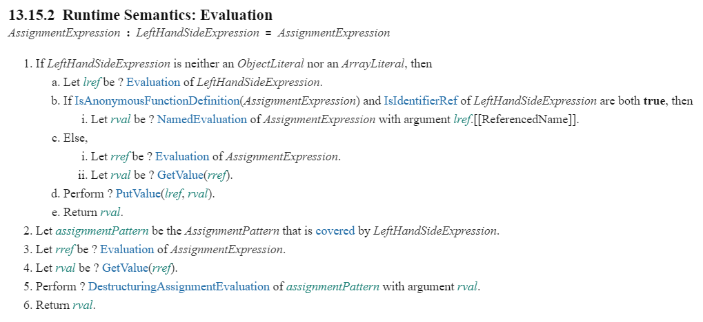
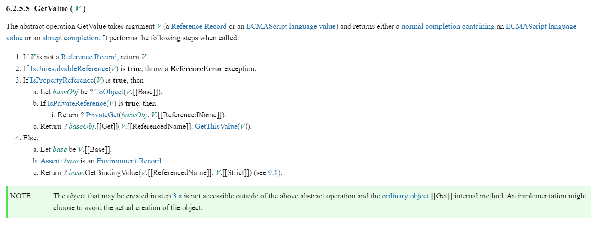
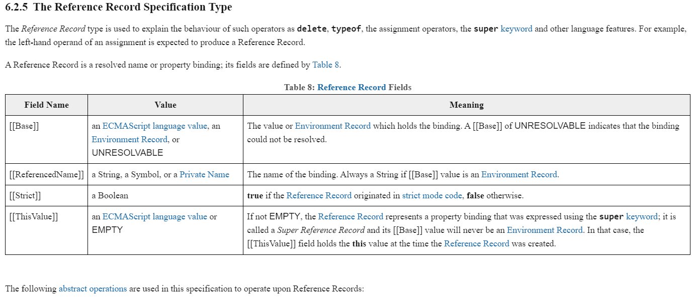

# 關於深淺拷貝的前備知識：你知道什麼是 call by sharing 嗎？

身為前端工程師，我想你一定在面試時遇過這樣的問題：<br>

「請解釋深淺拷貝的不同？」<br>
「哦~就是有沒有共用記憶體的區別呀！」<br>
「那你覺得實務上什麼時候會出現淺拷貝？非原始型別在 assign 的時候會出現什麼行為？傳遞的時候又會出現什麼行為？原理是什麼？」<br>
「Hmmm......」<br>

我認為這是一題可以從 junior 問到 senior 的問題，大部分的人都能答出差別在記憶體共用，但能詳細展開的人卻不多，我想這就是這題的鑑別度所在了。<br>

拒絕死背硬記，今天我們來揭開所有一知半解的觀念吧！工程師嘛！得時刻保持著求知欲才能不被時代淘汰。

### 一個簡單的範例：

```js
let testA = { a: 1 };
let testB = testA;
testB.a = 2;
console.log(testA); // { a: 2 }
```

因為物件的 assignment 在 javascript 裡面等於將**記憶體位址** pass 給另一個變數，也是所謂的 **call by reference** (注意：這個用詞可能不夠**精確**，後面會提到)，所以 testB 跟 testA 實際上是**同一個物件**，更改 testB 的屬性當然也就會改到 testA。<br>

junior 程度的工程師能夠解釋到這裡基本上就過關了，但是，如果你想了解更多，請繼續往下看...

### 再一個簡單的範例：

```js
let testA = { a: 1 };
let testB = 1;
let testC = { c: 1 };
function change() {
  testA = { a: 2 };
  testB = 3;
  testC.c = 2;
}
change();
console.log(testA, testB, testC); // {a: 2} 3 {c: 2}
```

這邊我們在函數裡面**直接操作外部變數**，一切都是那麼符合預期，直到...

### 一個不那麼簡單的範例：

```js
let testA = { a: 1 };
let testB = 1;
let testC = { c: 1 };
function change(testA, testB, testC) {
  testA = { a: 2 };
  testB = 3;
  testC.c = 2;
}
change(testA, testB, testC);
console.log(testA, testB, testC); // {a: 1} 1 {c: 2}
```

注意到了嗎？當我們把外部變數當成參數傳遞進 `function` 的時候，會跟我們直接在函數內操作外部變數有很大的不同，而其中的關鍵點就在"**傳遞**"，javascript 的傳遞行為有貓膩！或是說，其中有我們了解不夠透徹的地方。

### 天竺取經

唐僧一行人為了尋求大乘佛法前往西方取經，過程極其艱辛。如今，我為了更加了解 Javascript 的實作原理，也決定遠赴電子絲路取經，只求能獲得真理致道。

你可能會想問，宣揚佛法有無上真經，那理解 javascript 又有什麼？我想，那就只能是**ECMA-262**了。

> ECMAScript 是一種由 Ecma 國際（前身為歐洲電腦製造商協會）在標準 ECMA-262 中定義的手稿語言規範。這種語言在全球資訊網上應用廣泛，它往往被稱為 JavaScript 或 JScript，但實際上後兩者是 ECMA-262 標準的實作和擴充。

與無上真經不同的是，ECMA **每年都會有所更新**，以下所提到的規範都會是 [ECMA-262 15th edition, June 2024](https://262.ecma-international.org/15.0/index.html#sec-intro) 的內容。

那麼就讓我們踏上旅途吧！

### 首先我好奇， javascript 是如何為變數賦值的

知曉了這個，便知道為什麼會有記憶體共用的情形產生。

我看到 ECMA 其中的[這個](https://262.ecma-international.org/15.0/index.html#sec-assignment-operators-runtime-semantics-evaluation)章節詳細定義了 javascript 如何處理 variable assignment。



以前面的例子來說：
`let testA = { a: 1 }`

_LeftHandSideExpression_ = `let testA`<br>
_AssignmentExpression_ = `{ a: 1 }`<br>

> 1. If _LeftHandSideExpression_ is neither an ObjectLiteral nor an ArrayLiteral, then

判斷左邊有沒有解構的宣告如：`let { a } = obj`，在這邊顯然是沒有的，所以流程進入 1.a。

> 1.a. Let lref be ? Evaluation of _LeftHandSideExpression_.

把 `let testA` 作 `eval()` 的結果放進 lref 中。

> 1.b. If IsAnonymousFunctionDefinition(_AssignmentExpression_) and IsIdentifierRef of _LeftHandSideExpression_ are both true...

這裡沒有匿名函數，所以判斷不成立，跳過。

> 1.c.i. Let rref be ? Evaluation of _AssignmentExpression_.<br>
> 1.c.ii. Let rval be ? GetValue(rref).

先把 `{ a: 1 }` 作 `eval()` 再放進 rref 中，**再用 GetValue() 取得 rref 的值**。

> ### 於是問題來了，`GetValue()` 是什麼？



由定義可以看出，`GetValue()` 可以取得該變數對應的實際"值"，步驟如下：

> 1. If V is not a `Reference Record`, return V.

> ### 馬上迎來下個問題，那 `Reference Record` 又是什麼？

### Reference Record



> The Reference Record type is used to explain the behaviour of such operators as delete, typeof, the assignment operators, the super keyword and other language features. For example, the left-hand operand of an assignment is expected to produce a Reference Record.

第一段話就相當重要，在規範中寫明，**_Reference Record_ 是一種為了解釋語言底層原理而被發明的型別，並不存在於實作當中**，特別這邊舉的例子剛好就是 assignment 的情況。據他所言，`let testA` 經過 `eval()` 的結果就會是一個 _Reference Record_。

_Reference Record_ 具體包含了以下四個部分：

- `[[Base]]`: 可以簡單理解為 context，指的是綁定該變數的**執行環境**，可以是基本型別或是 _EnvironmentRecord_。
- `[[ReferencedName]]`: 該變數名稱。
- `[[Strict]]`: Boolean 值紀錄是否為嚴格模式。
- `[[ThisValue]]`: 跟 `super` 有關，在這先不討論。

> 任何說明都沒有直接看範例來的好理解，以前面的範例來說...

```js
let testA = { a: 1 }
// testA 經過 eval() 後對應的 Reference Record
{
  base: EnvironmentRecord,
  name: 'testA',
  strict: false
}
```

以上面這個例子來說，_EnvironmentRecord_ 就是 `window`，`window` 儲存了 testA 跟其他所有全域變數的綁定。<br>
你可能會想問，那什麼時候 `[[Base]]` 不會是 _EnvironmentRecord_ 呢？

> 我們再來舉個例子 🌰：

```
let testA = {
  a: function() {
    let b = { c: 1 }
    return b
  }
}
console.log(testA.a()) // { c: 1 }
// a 對應的 Reference Record
{
  base: testA, // object
  name: 'a',
  strict: false
}
// b 對應的 Reference Record
{
  base: EnvironmentRecord, // Function Environment Record
  name: 'b',
  strict: false
}
```

相信各位應該可以了解為什麼規範中寫 `[[Base]]` 可以是 _EnvironmentRecord_ 也可以是基本型別了吧！因為上述的例子 `a` 的 base 值就是 `testA` 這個 object (**因為 testA.a 這時候 a 的 context 是 textA**，這個觀念對於要理解 `this` 也是很受用的)。

當然，base 同樣也可以是 number or string，比如 `"hello world".toUpperCase()` 這時候 `toUpperCase` 的 base 值就是 `"hello world"` 這個 string。

### Bottom-up!

理解完了 _Reference Record_，是時候該回去看看 _GetValue()_ 跟 _Assignment operator_ 的定義了，還記得嗎？我們到剛剛為止的研究都是為了理解等號兩邊到底都作了些什麼事。

### 形參 (Parameter) 與實參 (Argument)

形參相當於函數中定義的變數，調用函數傳遞參數的過程相當於定義形參變數並且用實參的值來初始化。

### References

[ECMA-262-3 in detail. Chapter 8. Evaluation strategy](http://dmitrysoshnikov.com/ecmascript/chapter-8-evaluation-strategy/)<br>
[JavaScript 深入之从 ECMAScript 规范解读 this](https://github.com/mqyqingfeng/Blog/issues/7)<br>
[JavaScript 深入之参数按值传递](https://github.com/mqyqingfeng/Blog/issues/10)<br>
[深入探討 JavaScript 中的參數傳遞：call by value 還是 reference？](https://blog.techbridge.cc/2018/06/23/javascript-call-by-value-or-reference/)<br>
