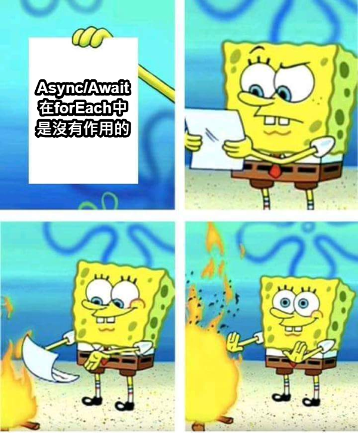
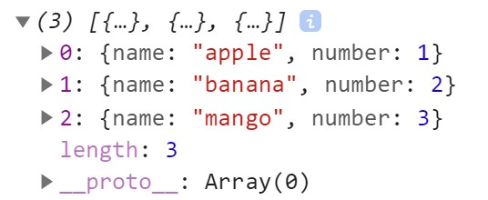
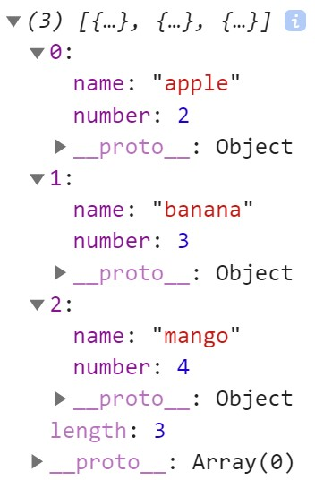
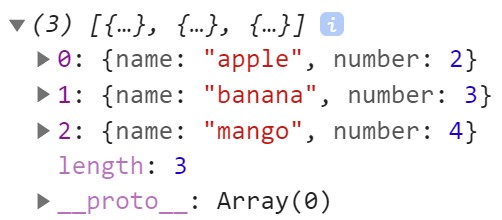
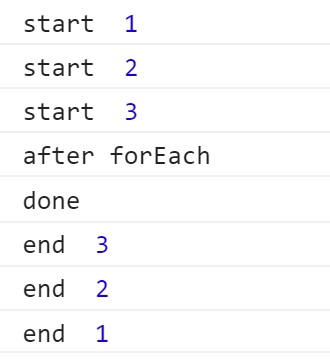

# async/await 在 forEach 裡面不起作用？你是否搞錯了什麼



### 「ㄟ~Zachary~~你可以過來幫我通靈一下嗎？」

前幾天公司同事寫程式遇到了 forEach 加上 async/await 的組合拳，卡關了許久仍不明所以，
於是叫上我幫忙解惑，身為通靈王的我，盯著他如下的程式碼：

```
const basket = [
  {
    name: 'apple',
    number: 1
  },
  {
    name: 'banana',
    number: 2
  },
  {
    name: 'mango',
    number: 3
  }
]
async function buyEachOne() { // 希望拿到每種水果+1的結果
  basket.forEach(async (item) => {
    const newNumber = await shopping(item.number)
    item.number = newNumber
  })
  console.log(basket)
}
function shopping(number) {
  return new Promise((resolve, reject) => {
    setTimeout(function() {
      resolve(number + 1)
    }, 2000)
  });
}
buyEachOne()
```

> 我將概念梳理了一下，流程簡化為菜籃中有若干種水果，我想為每樣水果都多添購一顆，每次購買須花費兩秒的時間，購買完成後將菜籃中所有水果的新數量打印出來。

好的！回到問題...<br>

「到底為什麼 console 出來數量沒有變啊！」他一臉懊惱的抱著頭低鳴<br>


<!--  -->

「而且...點了一下箭頭...」<br>


<!--  -->

「你看！我要的值又長出來啦！是怎樣，為什麼這世界這麼複雜啊啊啊？」<br>

見他開始歇斯底里，同樣也深感困惑的我開始在網路上找尋相關資料，發現會造成這種現象其實可以歸咎於兩個原因，也就是說，造成我同事崩潰的犯人，有兩位！<br>

**Chrome DevTool, Async/Await**<br>

就是你們(指

> ### 釋迦牟尼《法句經》中有言：莫輕小惡，以為無罪，小惡所積，足以滅身。

### Chrome DevTool

我們先說行小惡的兇手，Chrome DevTool！沒錯，就是你，不要以為把頭撇開我就抓不到你了(Chrome:
關我屁事。)<br>
事實上只要你把鼠標移到上圖的藍色 icon，就會出現 tooltip 告訴你原因了："Value
below was evaluated just now."<br>
意思是：以 chrome 來說，展開前的數值是 console 當下的值，而展開後則是現在存放在記憶體中最新的值，這其實是 chrome 的一個小巧思，讓開發者能夠更好地追蹤該地址的值前後為何，只是在這個例子中不幸變成苦惱我同事的一個盲點。

至於為什麼 console 當下數值會沒變更呢？這問題就牽涉到了我們今天的千古罪人，async/await 了！(async/await: 你再繼續誣陷我兩兄弟，我就把你打到你媽都不認識你。)

> 其實他倆兄弟是無辜的，前面只是玩笑話而已，各位客官請別太認真，他們現在拿著球棒站在我身後呢！

### async / await

我們都知道 JavaScript 是單執行緒的語言，其內部有著 Event Loop 機制，各位可能很困惑，奇怪，怎麼被威脅了一下，就開始講其他的東西不講 async/await 了呢？除了他們倆個手上的球棒真的很大根之外，其實，這些都是環環相扣的，觀念缺一不可。

如果對 Event Loop 機制不理解的人，可以參照<a href="https://pjchender.blogspot.com/2017/08/javascript-learn-event-loop-stack-queue.html">這篇</a>文章

**文章真的非常重要**<br>
**文章真的非常重要**<br>
**文章真的非常重要**<br>

我決定等你看完再繼續講解，放心，我很閒， 我可以在這等你一天都不是問題。<br>
至於如何算是完全理解 Event Loop？ 對不起，可能要請你去問 Brendan Eich，不過...<br>

[](https://www.youtube.com/watch?v=YOo001UM8PI)

當你可以完全預測上面這個影片的走向時，我相信你就可以繼續閱讀以下的文章了。

對這個視覺化 UI 有興趣的，可以參考這個<a href="http://latentflip.com/loupe/?code=JC5vbignYnV0dG9uJywgJ2NsaWNrJywgZnVuY3Rpb24gb25DbGljaygpIHsKICAgIHNldFRpbWVvdXQoZnVuY3Rpb24gdGltZXIoKSB7CiAgICAgICAgY29uc29sZS5sb2coJ1lvdSBjbGlja2VkIHRoZSBidXR0b24hJyk7ICAgIAogICAgfSwgMjAwMCk7Cn0pOwoKY29uc29sZS5sb2coIkhpISIpOwoKc2V0VGltZW91dChmdW5jdGlvbiB0aW1lb3V0KCkgewogICAgY29uc29sZS5sb2coIkNsaWNrIHRoZSBidXR0b24hIik7Cn0sIDUwMDApOwoKY29uc29sZS5sb2coIldlbGNvbWUgdG8gbG91cGUuIik7!!!PGJ1dHRvbj5DbGljayBtZSE8L2J1dHRvbj4%3D">網站</a>

### 讓我們用上面影片的邏輯來重新檢視一下這個範例

```
async function buyEachOne() { // 希望拿到每種水果+1的結果
  basket.forEach(async (item) => {
    const newNumber = await shopping(item.number)
    item.number = newNumber
  })
  console.log(basket)
}
function shopping(number) {
  return new Promise((resolve, reject) => {
    setTimeout(function() {
      resolve(number + 1)
    }, 2000)
  })
}
```

我們首先觀察 `buyEachOne()` 這個 function，程式先用 `forEach()` 對 `basket` 進行遍歷，依序執行傳入 `forEach()` 的三個 callback，執行到 `shopping()` 的時候發現遇到了 `setTimeOut()`，因此將 `setTimeOut()` 交由 Web APIs 進行處理，接著由於 `await` 的效果，暫時凍結內部執行環境，至此，第一個 callback 處理完畢。**這樣的流程會重複不間斷地執行三次。**

`forEach()` 的三個 callback "處理"完以後 (**注意：此時三個 callback 內部仍然是凍結狀態，因為在等待`setTimeout()`**)，接著程式執行到了 `console.log()` 這一行，所以才有了上面 chrome 的打印：**水果們並沒有得到+1 的結果**。

> 試想如果單執行緒的 JS 沒有 Web API 輔助，停留在原地等待三個 callback 執行完畢，那總共就是等待六秒的時間才能執行其他任務，網頁如果阻塞六秒，使用者早就已經跑光光了 :P

過了不久，剛剛被我們暫時置之不理的那三個 setTimeout 也在 Web API 的機制幫助下等待了兩秒並將後續程式塞入工作佇列(task queue)當中了。

當 stack 中的事件執行完畢之後，Event Loop 機制才會將工作佇列(taskqueue)中的事件逐一塞入 stack 中並執行，直到這時候，那三個 callback 才結束凍結繼續運行，而水果的數量**才真正地進行更新**。

### 還記得開頭的那張迷因嗎？

我曾看過不少人說 async / await 在 forEach 中是不起作用的，但其實事實並不是這樣，以結果來說，async / await 依舊保證了函式內部的執行順序，以這個例子而言，就是**等待了兩秒後才更新水果的數量**，但他**不能保證的是，函式外部 callstack 會先跳過他來執行其他程式。**(async / await：說得不錯，今天就饒你一命)

> ㄟ等等，講了這麼多，所以你到底有沒有幫你同事解決問題啊？

阿對了，差點忘記在一邊懷疑人生的同事了，其實解決方式非常簡單，只要把 forEach 換成 for...of 就解決了！

```
async function buyEachOne() { // 希望拿到每種水果+1的結果
  /* basket.forEach(async (item) => {
    const newNumber = await shopping(item.number)
    item.number = newNumber
  }); */
  for (let item of basket) {
    const newNumber = await shopping(item.number)
    item.number = newNumber
  }
  console.log(basket)
}
```



> ### 這真是太神奇了傑克！！

其實懂了 Event Loop 的原理後，這樣的結果也沒什麼好驚訝的了。<br>
async / await 的作用是保證當前函式的執行順序，而 forEach 與 for 的最大區別就在於 forEach 是傳入 callback 來執行，因此對於 async/await 來說，當前函式是那三個 callback，也就是說，這邊它的作用是凍結那三個 callback function 內部。<br>
但 for...of 就不同了，它內部的 await 會凍結最近的 async function，也就是凍結 buyEachOne()的執行，因此才會有我們想要的結果出現。

### 如果你認為你已經理解上面的範例，那就不妨試試下面這個吧!

```
const example = async () => {
  const nums = [1,2,3]
  nums.forEach(async num => {
    console.log('start ', num)
    const result = await returnNum(num)
    console.log('end ', num)
  })
  console.log('after forEach')
}
const returnNum = x => {
  return new Promise((resolve, reject) => {
    setTimeout(() => {
      resolve(x)
    }, 500*(5-x))
  });
}
example().then(() => {
  console.log('done')
})
```

給自己一段時間思考吧！<br>
.<br>
.<br>
.<br>
.<br>
.<br>
.<br>
.<br>
.<br>
.<br>

思考完後看解答 ↓<br>
<br>
希望解答有跟你心目中的一樣！
如果有些許疑惑，關鍵字 **micro task** 去搜尋看看 :)

### 結語

今天帶各位看了 forEach & async / await 常見的迷思，希望這種深入淺出的內容可以幫助到大家！<br>
一方面是拋磚引玉，一方面這篇文章也是寫給當初的自己，希望當初困惑的自己在網路上看到這篇文章，除了感到有趣以外，也可以對 JS 的 Event Loop 機制激起求知慾，去找尋更多網路資料，而不是一句「改用 for...of 就好，就這樣吧。」
