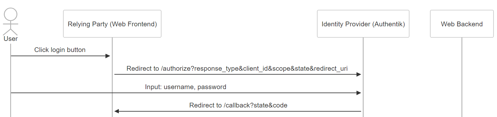
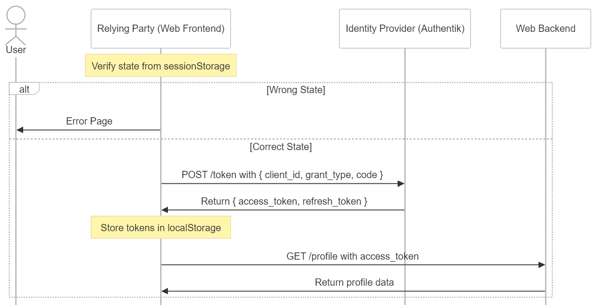
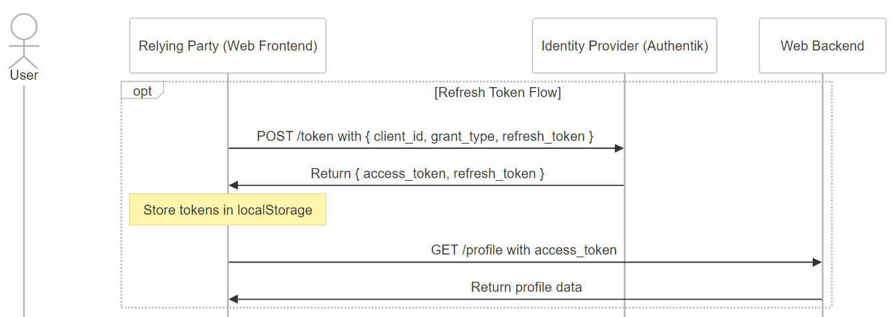
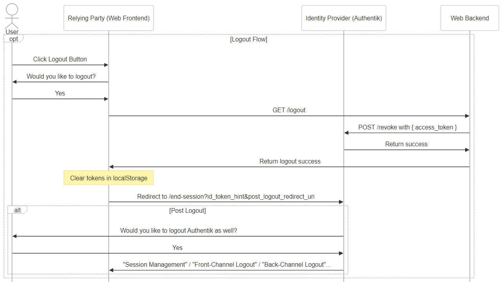

# 初探 OIDC ─ 揭開我們每天都在使用，卻不了解的黑盒子

我多年前曾經串過 Google Oauth2，現在想要把技術債一次補齊，因此這篇文誕生了！🎉 
OIDC 是建構於 Oauth2 之上的一種"**身分驗證**"協議，常見的 Flow 有三種，本文將著重介紹我所使用的 Hybrid Flow。 

注意：請不要把 Oauth 與 OIDC 混為一談，**Oauth 是一種"授權"協議，沒有驗證功能**，`access_token` 本身只單純作為取得某權限的令牌使用，而且在 Oauth 中你沒辦法單純用 `access_token` 解析出他是誰。 

不過 OIDC 就不同了，可以用作身分驗證之外，他的 `access_token` 通常是 JWT，你可以透過 decode JWT 來獲得 payload，進而得知該名使用者的基本資訊。

### 關於身份定義那件事

在講述任何流程之前，我喜歡先把角色定義好，避免流程搞懂但角色混淆而不知如何應用的情況。

- **User:** 一般使用者
- **Relying Party (RP):** 在這邊指的是 SPA 架構下的網站前端
- **Identity Provider (IdP):** 我這邊用的是 Authentik，常見的有 Google, Facebook, Line...等第三方登入驗證服務
- **Web Backend:** 也可以稱作 Resource Server

### 1. 重導向的登入流程

_**1.1 使用者點擊登入**_ 
_**1.2 前端隨機產生 state 並儲存在 sessionStorage 內**_ 
_**1.3 前端將使用者導向 Authentik 的登入頁面，一併帶上 state, redirect_uri 等參數**_ 
_**1.4 登入成功後 Authentik 根據 redirect_uri 導回前端的 /callback 頁面，並帶上 state, code 參數**_ 

在這個階段，Authentik 成功得知了該使用者是誰，並且將他導回到我們的前端頁面，但此時網頁前端還沒有取得對應的 access_token，只有拿到 Authentik 回傳的 state 跟 code 而已。 

補充：在這邊也可以直接請 Authentik 把 access_token 帶在網址列上回傳給你，省略回傳 code 的步驟直接完成登入流程。這也是所謂的 **OIDC Implicit Flow，屬於流程相對簡單，但安全性相對較低的一種方式**。

### 2. 取得 access_token

_**2.1 驗證 Authentik 帶回來的 state 跟當初儲存在 sessionStorage 是否相同**_ 
_**2.2 若不同，則顯示錯誤給使用者**_ 
_**2.3 若相同，則用 POST 方法打向 /token 並帶上 code 等參數**_ _(`Content-type: application/x-www-form-urlencoded`)_  
_**2.4 Authentik 回傳 access_token, refresh_token**_ 
_**2.5 前端將這兩個 token 儲存至 localStorage**_ 
_**2.6 前端開始與 Web Backend 互動，進入一般的登入流程，例如把 access_token 帶在 Authorization Header 裡面：`Authorization: Bearer ${access_token}`**_ 

### 3. Refresh Token 的流程

_**3.1 前端可透過解析 access_token (JWT decode)來取得 expired time，並主動設定一個 timer 到期通知**_ 
_**3.2 收到 timer 通知後，用 POST 方法打向 /token 並帶上 refresh_token 等參數**_ 
_**3.3 Authentik 回傳 access_token, refresh_token**_ 
_**3.4 前端將這兩個新的 token 儲存至 localStorage**_ 
_**3.5 重新進行 2.6 的登入流程**_ 

補充：可以在快要到期前提早取得新的 token，避免使用者操作時發生錯誤；而重新登入的動作推薦用 AJAX 背景執行就好，避免網頁產生使用者非預期行為比如重整之類。

### 4. Logout 的流程

Logout 的流程可以分為四種，分別是：

- [RP-Initiated Logout](https://openid.net/specs/openid-connect-rpinitiated-1_0.html#RPLogout)
- [OpenID Connect Session Management](https://openid.net/specs/openid-connect-session-1_0.html)
- [OpenID Connect Front-Channel Logout](https://openid.net/specs/openid-connect-frontchannel-1_0.html)
- [OpenID Connect Back-Channel Logout](https://openid.net/specs/openid-connect-backchannel-1_0.html)

後三者主要是定義 IdP-initiated logout flow，也就是由第三方"主動"發起的登出請求，由於現在不需要應對這種情境，所以就容許我先不展開說明了。 

這篇文章主要會聚焦在 RP-Initiated Logout 的部分，一樣先來看流程圖吧！ 

4.1 先確定使用者登出的意願，前端可以跳出提示彈窗作雙重確認。 
4.2 前端透過 AJAX 打向後端，等待後端回應。 
4.3 後端將 client_id 以及 client_secret 放入 Basic Auth Header (EX: Authorization: Basic ${client_id}:${client_secret})，然後打向 IdP /revoke 做 token 的撤銷 (若有實作 cookie session 也同步在這一步驟清除 session)。 
4.4 後端確認註銷成功以後回覆前端 logout success。 
4.5 前端清除 localStorage 中的 token，到這，登出就算完成了。 
4.6 可根據專案需求決定是否進入 post logout 流程，若有需要則將使用者重導向至 IdP /end-session。 
4.7 每個 OpenID Provider 的實作不同，以 Authentik 為例，會是一個網頁上面寫著"你已成功登出某服務"，下面有按鈕寫著"登出 Authentik"。 
4.8 若使用者點擊登出，則意味著他也一併登出了 IdP 的 session，下次重新登入我們網站需要重新輸入 Authentik 的密碼。 
4.9 IdP 登出後，利用前面提到的 OpenID Connect Session Management / OpenID Connect Front-Channel Logout / OpenID Connect Back-Channel Logout 的其中一種 Flow 來讓其他 RP 接收到 IdP 登出的訊息，然後主動登出那些 RP。 

補充說明： 

如果沒有進入 post logout 流程，下次使用者登入我們的服務時，導去 Authentik 的瞬間會馬上導回來，使用者不需要重新輸入帳密 **(因為 idP 的 session 並沒有被清除)**，乍看之下很方便，**但當他需要切換帳號時就會遇到困難。** 

另外有的人會認為登出流程是否需要確認 revoke token 成功後再清除我們服務的 session 還有前端的 localStorage 等資訊，但我在 spec 中翻到了這麼一段話：

> It is up to the RP whether to locally log out the End-User before redirecting the User Agent to the OP's Logout Endpoint.

所以可以根據商業邏輯來更改登出的順序性，並不一定要依賴於 revoke token 的正確性或是第三方的回覆等才能繼續做事。

> On the other hand, some logout notification methods from the OP to the RP are unreliable and therefore the notification might not be received.

**spec 中的這段話也同樣表明依賴於第三方回覆有時是不可靠的，所以 RP 可以在跟 idP 互動前預先登出。**

### References

深入淺出 OpenID Connect (一): https://shuninjapan.medium.com/%E6%B7%B1%E5%85%A5%E6%B7%BA%E5%87%BA-openid-connect-%E4%B8%80-8701bbf00958 
2022 鐵人賽 Identity Management: https://ithelp.ithome.com.tw/articles/10300430 
OpenID Connect RP-Initiated Logout 1.0: https://openid.net/specs/openid-connect-rpinitiated-1_0.html#RPLogout
OpenID Connect Logout: https://medium.com/@robert.broeckelmann/openid-connect-logout-eccc73df758f
