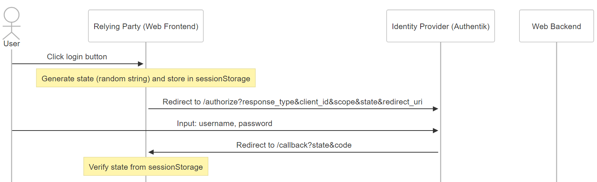

# 初探 OIDC，完整的登入流程

多年前曾經串過 google Oauth2，現在想要把技術債一次補齊...

### 關於身份定義那件事

- User: 一般使用者
- Relying Party (RP): 在這邊指的是 SPA 架構下的網站前端
- Identity Provider (IDP): 我這邊用的是 Authentik，最常見的有 Google, Facebook, Line...等第三方登入驗證服務。

### 1. 重導向的登入流程

1.1
