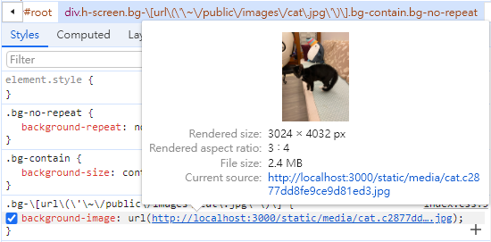
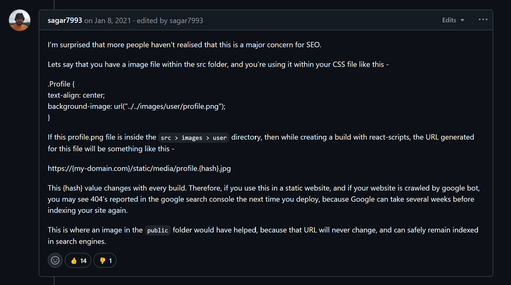
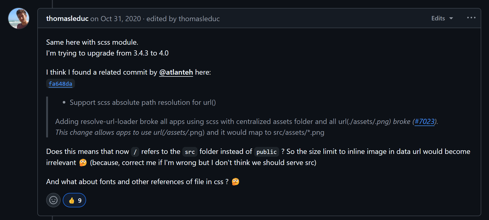
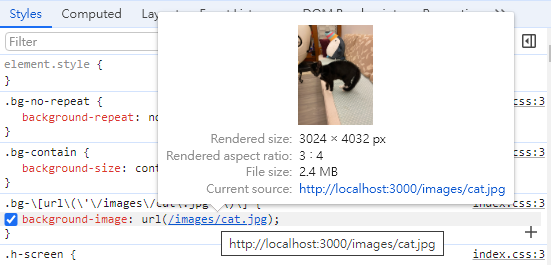
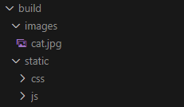

# Cannot resolve url() ─ CRA 用 url() 引入圖片的坑


### 專案使用 create-react-app + Tailwind CSS，使用以下寫法時遇到路徑無法解析的問題

`<div className="bg-[url('/images/cat.jpg')]">`

推測原因應該跟 CRA 預設的 webpack 設定有關，我在網上找到這樣一個 issue，底下哀鴻遍野：
https://github.com/facebook/create-react-app/issues/9937

大家都表示把圖片放在 public 裡面會讀不到，就在群眾一片焦頭爛額時<br>

我看到在 issue 中有人建議，將你的路徑改為這樣：

`<div className="bg-[url('~/public/images/cat.jpg')]">`

馬上來看看這種解法是否可行<br>


可以耶！圖片成功出現了！打完收工？<br>
**咦？等等.......路徑為什麼怪怪的？**

### 這時候你有兩個選擇，追根究柢抑或是得過且過

因為我實在是太好奇了，於是繼續往下滑 issue，直至看到這個評論：



大意是說上面那種方式，是由 `webpack` 幫你把用到的圖片打包進專案，並且將路徑設置為 `static/media/cat.{hash}.png`來對應，雖然一樣可以載入圖片，這樣會導致每次 build 完都有不同的 hash 值，**這會令 google 爬蟲爬不到穩定的圖片來源，因而降低網站 SEO。**

於是我實際 build 了一下剛剛的專案，發現：<br>


確實如他所說會存進 `static/media/`，並且由於原本我們是把圖片存在 `public/images` 裡面，因此 `webpack` 也會幫你額外複製一份出來，導致最終 build 出來的檔案裡竟然有兩張一樣的圖片。

### 這種無謂增加 bundle size 的作法應該要想辦法避免！慶幸自己剛剛選擇了追根究柢！



我繼續爬完了 issue，發現整件事的起因是有個 contributor 發了個 PR，透過 `resolve-url-loader` 套件把所有`url()`的根目錄從`public/`改為`src/`，所以才有了這麼多的事情 (相關commit看[這裡](https://github.com/facebook/create-react-app/commit/fa648daca1dedd97aec4fa3bae8752c4dcf37e6f))。

這個 breaking change 並沒有特別在 CRA 的官方文件中提到，因此也讓開發者們哀鴻遍野。

就在群眾焦頭爛額的時候救世主出現了：


這位大神提到可以將`css-loader` 內部的 url 改為 false 來解決這個問題！

我們趕快來看看 `css-loader` 的 options 定義：


從文件中可以發現：<br>

當 `url: true`（預設值）時，Webpack 會自動處理圖片的相對路徑，並且把它從 `src/` 底下複製一份到 `dist/`。<br>

然而當 `url: false` 時，Webpack 會忽略 url() 內的路徑，也就是說，如果你是這樣用：<br>
`<div className="bg-[url('/images/cat.jpg')]">`<br>

webpack 就再也不會自動幫你去 `src/` 底下找圖片並且複製到 `dist/` 了，變成保留你的原始路徑，因此，只要你有把圖片放進 `public/images` 底下，你的 `dist/` 裡面原本就會有一包 `images/`，這時候上面的絕對路徑就可以幫你把圖片抓出來。

### 所以這個方法的確可以解決我們的問題！

那麼接下來的目光應該是要放在如何更改 `webpack` 的設定檔：

前面那位大神用的是 `craco` 擴充 `create-react-app` 預設的 webpack config，但我看了一些推薦文，最後決定使用 `react-app-rewired` 套件來幫我進行擴充，目標是把 `css-loader` 內部的 url 改為 false。

因為只需要動到少部分的 config，我這裡不傾向 eject 出來維護整個 webpack config，**這樣如果未來套件更新我會很難在本地端同步。**

那麼...要怎麼擴充呢？只能去看看 `react-scripts` 的 webpack config 裡面都做了些什麼事了 😓...

(以下忽略數分鐘的 trace code 過程...)

終於讓我找到設定`module.rules`的地方：

```js
// react-scripts/config/webpack.config.js
module: {
  ...
  rules: [
    ...
    {
      oneOf: [
        ...
        // "postcss" loader applies autoprefixer to our CSS.
        // "css" loader resolves paths in CSS and adds assets as dependencies.
        // "style" loader turns CSS into JS modules that inject <style> tags.
        // In production, we use MiniCSSExtractPlugin to extract that CSS
        // to a file, but in development "style" loader enables hot editing
        // of CSS.
        // By default we support CSS Modules with the extension .module.css
        {
          test: cssRegex,
          exclude: cssModuleRegex,
          use: getStyleLoaders({
            importLoaders: 1,
            sourceMap: isEnvProduction
              ? shouldUseSourceMap
              : isEnvDevelopment,
            modules: {
              mode: 'icss',
            },
          }),
          // Don't consider CSS imports dead code even if the
          // containing package claims to have no side effects.
          // Remove this when webpack adds a warning or an error for this.
          // See https://github.com/webpack/webpack/issues/6571
          sideEffects: true,
        },
      ]
    }
  ]
}
```

而當中有一句註解是這樣寫的：<br>
`"css" loader resolves paths in CSS and adds assets as dependencies.`<br>
也證實了這個設定確實就是我們要找的。

繼續往下探索，看到了這個 function：

```js
// common function to get style loaders
  const getStyleLoaders = (cssOptions, preProcessor) => {
    const loaders = [
      ...
      {
        loader: require.resolve('css-loader'),
        options: cssOptions,
      },
      ...
    ]
    ...
    return loaders
  }
```

**🔪「Here is Johnny!!!!!」**<br>
找到了 `css-loader`，看起來只要把外部傳入的 cssOptions 想辦法加上 `url: false` 就可以了！

經過一段時間的測試後，**我發現這種寫法可以順利覆寫我要的屬性，並且解決這個問題 🙌：**

```js
// config-overrides.js
const path = require("path");
module.exports = function override(config) {
  const targetRegex = /\.css$/;
  const targetPackage = /css-loader/;
  // to make url() in css worked
  config.module.rules
    .find((r) => r.oneOf)
    .oneOf.find((r) => r.test.toString() === targetRegex.toString())
    .use.find(
      (o) => o.loader && targetPackage.test(o.loader)
    ).options.url = false;
  return config;
};
```

結果：<br>



貓貓圖片成功出現了，並且 build 出來的檔案只有 public/images 底下的那一張圖片，也沒有重複的問題，這次真的可以打完收工了。

### 結語

沒想到這麼小的問題竟然也隱藏著這麼多細節，為自己不留技術債的態度豎起一根大拇指！👍<br>
啊！順便去 Github issue 底下留個言，看能不能幫助更多的開發者好了，畢竟沒有那串 issue 我可能還不知道該怎麼定義問題呢！有能力回饋社群的感覺真好。<br>
https://github.com/facebook/create-react-app/issues/9937
